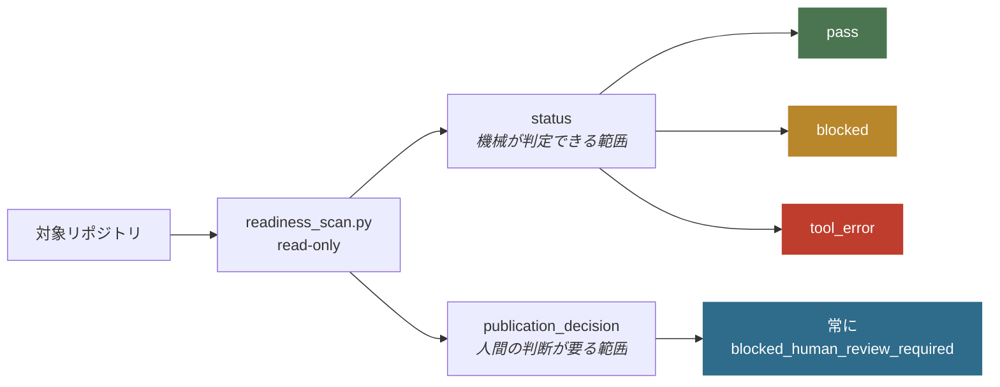
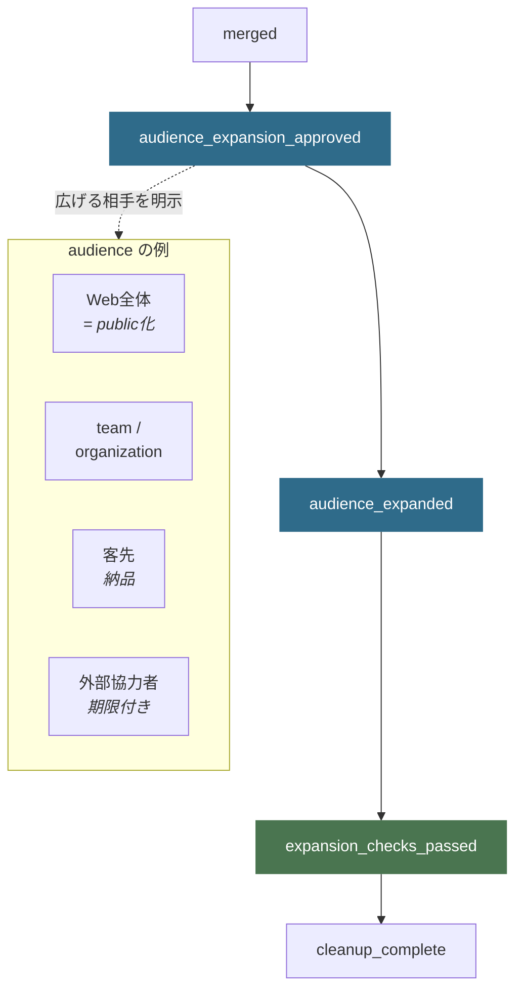

# Repo Preflight

Gitリポジトリを見せる相手を広げてよいか判断する、読み取り専用のCLIとチェック手順です。機械で確認できたこと、人が確認すべきこと、確認できなかったことを分けてJSONで返します。

public化専用ではありません。privateリポジトリをチームへ開くとき、成果物を客先へ納品するとき、外部の協力者へ渡すときも、必要な検査は同じです。

> **v0.1.x から来た方へ** — v0.2.0 でリポジトリ名と必須ファイル名が変わりました。
> `public-readiness` → `repo-preflight`、`PUBLIC_READY.md` → `PREFLIGHT.md` です。
> 移行手順は [v0.1.x からの移行](#v01x-からの移行) を読んでください。

## 目的 — 答えること、答えないこと

テストが通ったことと、公開してよいことは別です。この分離が設計の中心にあります。



`status: pass` は「このCLIが担当するローカル自動検査に合格した」という意味だけを持ちます。
`publication_decision` は常に人間レビューを要求し、自動で `approved` にはなりません。
**`pass` だけを根拠に公開しないでください。**

## できること — 検査する項目

| 対象 | 内容 |
|---|---|
| リポジトリ状態 | repo root、Git状態、remote、作者履歴 |
| 必須文書 | README / LICENSE / SECURITY / CONTRIBUTING / PREFLIGHT |
| 秘密情報 | 現在treeと**全Git履歴**のsecret候補 |
| 個人環境 | 絶対パスなど環境固有の文字列 |
| 依存とCI | 依存定義ファイルの有無、CI設定の最低限の構造 |

削除済みのファイルも履歴に残っていれば検出します。検出結果に秘密値そのものは出力しません。

## 制約 — 検査しない項目

次はリポジトリごとに別の証拠が必要です。CLIは「確認していない」と明示して返します。

| 対象 | なぜCLIで判定しないか |
|---|---|
| 依存ライブラリの既知脆弱性 | エコシステム固有の最新監査が要る |
| 第三者素材を公開する権利 | 法的判断 |
| branch保護・review必須設定 | GitHub側の現在状態 |
| CIが実際に成功したか | remoteの実行結果 |
| 障害の通知先、復旧手順 | 実際に試した記録が要る |
| README・個人情報・公開範囲の目視 | 人間の確認 |

内蔵の正規表現は代表的な秘密情報の形式を検出する補助機能です。**秘密情報が存在しないことは保証しません。**
独自形式、分割・符号化された値、2 MBを超える履歴ファイル、画像やバイナリ内の情報は見逃す可能性があります。
専門のsecret scanner、依存関係の監査、人間レビューを必ず併用してください。

## クイックスタート

PyPIには公開していません。このリポジトリを取得して、**検査したいリポジトリのパスを渡します**。
追加の依存はなく、Python 3.11以降とgitがあれば動きます。

```bash
git clone https://github.com/nexus-ai-2045/repo-preflight.git
cd repo-preflight
python scripts/readiness_scan.py --repo /path/to/your-repo
```

Windows (PowerShell) の場合:

```powershell
python scripts\readiness_scan.py --repo C:\path\to\your-repo
```

出力は常にJSONです。整形やフィルタは `jq` などに任せます。

```json
{
  "status": "pass",
  "publication_decision": "blocked_human_review_required",
  "repo": "your-repo",
  "head": "c6bb6af2...",
  "checks": {
    "secret_scan": { "status": "pass", "finding_count": 0 },
    "required_documents": { "status": "pass", "missing": [], "invalid": [] },
    "commit_identity": { "status": "pass", "identity_count": 1 },
    "ci_runtime_result": { "status": "unknown", "reason": "requires_current_remote_ci_evidence" }
  }
}
```

### オプション

| オプション | 用途 |
|---|---|
| `--repo <path>` | 検査対象。必須 |
| `--release` | README情報設計ゲートも同時に実行する |
| `--expected-identity "<Name> <mail>"` | 全commitの作者/committerが指定の名義かを検査する |

公開名義を統一しているリポジトリでは、履歴に個人名義が混ざっていないかを確認できます。

```bash
python scripts/readiness_scan.py --repo /path/to/your-repo \
  --expected-identity "Example <dev@example.invalid>"
```

### 終了コード

| コード | 意味 |
|---|---|
| `0` | CLIが扱う必須項目がpass |
| `1` | failまたはunknownがあり `blocked` |
| `2` | Gitや履歴取得など検査自体が失敗 |

CLIは既定で読み取り専用です。リポジトリ作成、push、PR、merge、visibility変更、投稿は行いません。
`--release` もREADMEやreleaseを自動で変更・作成しません。

## 見せる相手を広げる流れ

public化は終点のひとつであって、唯一の終点ではありません。
どの相手に広げる場合も、承認 → 実測 → 再確認の3段を通ります。



`audience` ごとに必要な証拠が変わります。public化なら「Webから見えるファイルと全commit履歴」、
team共有なら「collaborator権限とaccess一覧」、外部協力者なら「付与した権限と失効条件」です。
private保存、PRまで、mergeまでも正規の完了地点として扱います。詳細は [状態一覧](references/lifecycle.md)。

## v0.1.x からの移行

v0.2.0 で2つの名前が変わりました。旧名 `public-readiness` は「public化がゴール」と読めますが、
この道具は private 保存やチーム共有も正規の完了地点として扱うため、設計と名前が食い違っていました。

| 対象 | v0.1.x | v0.2.0 |
|---|---|---|
| リポジトリ / パッケージ | `public-readiness` | `repo-preflight` |
| 必須のレビュー記録 | `PUBLIC_READY.md` | `PREFLIGHT.md` |
| README gate の schema | `public-readiness.readme-release-gate/v1` | `repo-preflight.readme-release-gate/v1` |

検査対象のリポジトリ側で必要な作業:

```bash
git mv PUBLIC_READY.md PREFLIGHT.md
```

さらに `PREFLIGHT.md` の先頭に次の1行を置いてください。

```markdown
<!-- repo-preflight:review-record -->
```

`PREFLIGHT` は一般的な語なので、deployment preflight 手順書のような無関係な同名ファイルが
存在しえます。CLIはこのマーカーの有無でレビュー記録かどうかを判別します。マーカーが無い場合は
`required_documents` が `invalid` として fail します。テンプレートは [assets/PREFLIGHT.template.md](assets/PREFLIGHT.template.md)。

旧URL `github.com/nexus-ai-2045/public-readiness` はGitHubのリダイレクトで引き続き解決します。
旧名は永久欠番とし、再利用しません。

## Skill

Codexなどのエージェントから使う場合は [SKILL.md](SKILL.md) を入口にしてください。
状態遷移、承認境界、成果物テンプレートを同梱しています。

公開リポジトリのruleset、merge方式、Actions権限、security機能の選択理由は
[GitHub repository設定ガイド](references/github-settings.md) を参照してください。

## License

MIT License。詳細は [LICENSE](LICENSE) を参照してください。
