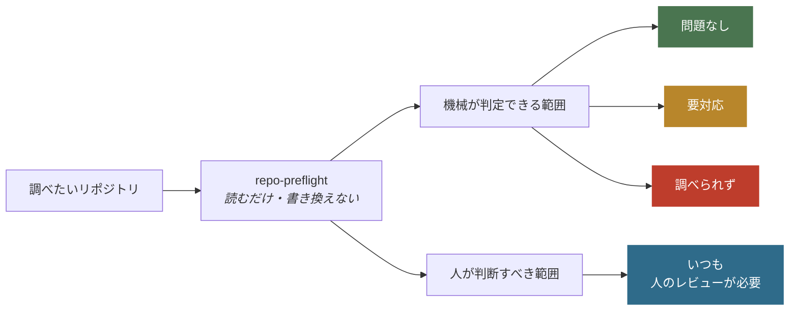
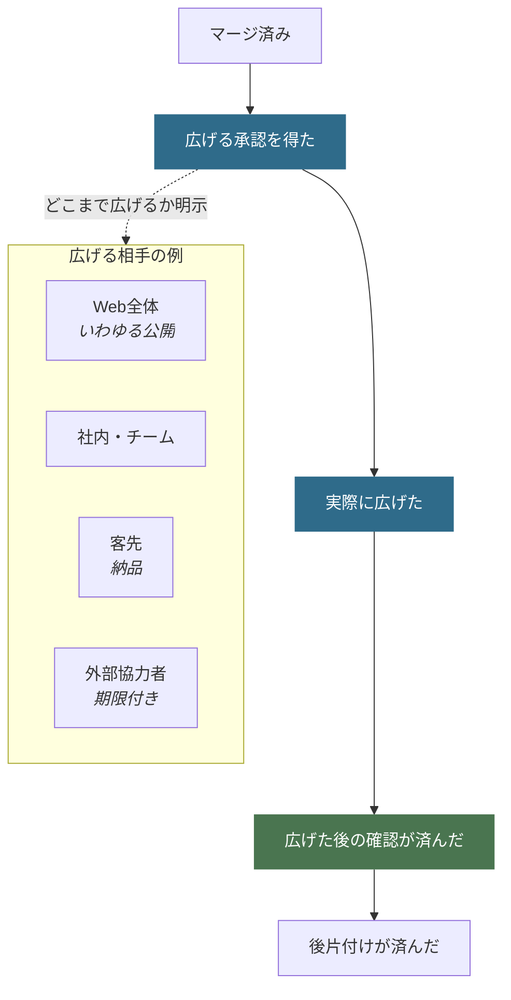

# Repo Preflight

**リポジトリを人に見せる直前に、見せてはいけないものが混ざっていないかを機械で調べる道具です。**

APIキーらしき文字列や自分のPCのパスを、今あるファイルだけでなく**削除済みを含むGitの全履歴から**探します。必須の文書がそろっているか、文書とコードの食い違いがないかも確認します。結果は決まった形式で返るので、人だけでなくAIエージェントやCIからも同じ基準で使えます。

> [!IMPORTANT]
> このツールが「合格」と言っても、それは**機械で調べられた範囲に問題がなかった**という意味だけです。公開してよい、pushしてよい、という承認ではありません。外へ影響する操作は必ず人が決めてください。

| したいこと | 読む場所 |
|---|---|
| まず動かす | [使い方](#使い方) |
| 結果の見方 | [結果の読み方](#結果の読み方) |
| 何を調べるか / 調べないか | [できること](#できること) / [制約](#制約) |
| AI から使う | [AIエージェントから使う](#aiエージェントから使う) |
| GitHub Settings を確認 | [AIエージェントから使う](#aiエージェントから使う) |
| 引数と終了コード | [CIから使う](#ciから使う) |

## 使い方

**利用（検査だけ）**に必要なのは Python 3.11 以降と Git だけです。追加のパッケージはありません。

```bash
git clone https://github.com/nexus-ai-2045/repo-preflight.git
cd repo-preflight
python scripts/readiness_scan.py --repo /path/to/your-repo
```

調べたいリポジトリは、このツールとは別の場所にあってかまいません。中身は読むだけで、書き換えません。

**開発・テスト・CI**では `pip install -e ".[test]"` が必要です。手順は [CONTRIBUTING.md](CONTRIBUTING.md) を参照してください。

### 結果の読み方

同じ CLI でも、返す JSON の schema と `status` 語彙が分かれます。混ぜて読まないでください。

| モード | いつ | schema | `status` |
|---|---|---|---|
| 検査 | `--repo` のみ、または CI | `repo-preflight.scan/v3` | `pass` / `blocked` / `tool_error` |
| 対話 | `--intent` 指定時 | `repo-preflight.dialogue/v3` | `needs_human_input` / `blocked` / `ready_after_confirmation` |
| 抑止記録 | `--record-dismissal` | `repo-preflight.preferences/v1` | `recorded` |

検査モード:

| 返る値 | 意味 | 次にすること |
|---|---|---|
| `pass` | 機械の範囲では引っかからなかった | 中身と見せる相手を人が決める |
| `blocked` | 直すべき点がある | 指摘に対応してもう一度実行する |
| `tool_error` | Gitやファイルを十分に読めなかった | この結果を判断に使わない |

対話モード（詳細は [SKILL.md](SKILL.md)）:

| 返る値 | 意味 | 次にすること |
|---|---|---|
| `needs_human_input` | 質問や設定確認が残っている | 人に聞いてから外への操作をしない |
| `blocked` | secret 等で fail-closed | 無視して進まず、修復方針を聞く |
| `ready_after_confirmation` | 機械不足は埋まっている | 最終確認のあと intent 準備へ |

読めなかったものを「問題なし」とは言いません。**判断がつかないときは、通さない側に倒します。**

## 目的

テストが通ったことと、公開してよいことは別です。この分離がこのツールの中心にあります。



右下は自動では変わりません。**「問題なし」だけを根拠に公開しないでください。**

## できること

- **認証情報らしき文字列**（APIキー、トークン、秘密鍵の形）と**自分のPCのパス**。消したつもりでも履歴に残っていれば見つけます
- **必須の文書**がそろっているか（README.md、LICENSE、SECURITY.md、CONTRIBUTING.md、PREFLIGHT.md）
- **コミットの名義**（作者・コミッターが意図した名前か）
- **文書とコードの食い違い**（リンク切れ、READMEに書いたコマンドと実体のずれ、コードを変えたのに文書やテストが追随していない、生成物が古い）
- **READMEが読める形か**（必須の節、長さ、日本語のときは表が横に伸びすぎていないか・図のラベルが本文と同じ言語か）。表の幅と図のラベルは初期は警告に留め、誤検知がないことを確認してからエラーへ上げます
- GitHubの設定ガイドや運用記録の不足
- `--intent configure_settings` のときだけ、GitHub Settings の現在値を read-only で実測する

読むだけで、リポジトリの中身は一切書き換えません。Settings の変更も実行しません。

## 制約

ここは**人が確かめるか、別の道具に任せる**部分です。

- 公開、push、PR、マージ、公開範囲の変更**そのものの実行**（このツールは操作しません）
- 公開してよい権利があるか、個人情報かどうかの**最終判断**
- 使っているライブラリに既知の脆弱性がないか
- GitHub Settings の**変更**。実測と差分previewは `configure_settings` まで
- CIが remote で実際に成功したか
- 「秘密情報が絶対に存在しない」という完全な保証

内蔵の検出は、よくある形式に当てはめて探す補助機能です。**専門の検査ツールと人のレビューを必ず併用してください。**

項目ごとの理由は [保証すること / 保証しないこと](docs/guarantees-and-limits.md) にまとめています。

## AIエージェントから使う

エージェントが次の操作へ進む**直前**に自動で走らせます。人が毎回「チェックして」と言う必要はありません。


```bash
python scripts/readiness_scan.py --repo PATH --intent <場面> --human
```

| 場面 | `--intent` | 追加引数 | 主に確認すること |
|---|---|---|---|
| リポジトリを新しく作る | `create_repo` | `--repo` 不要 | 公開範囲、最初の文書、名義 |
| push する | `push` | `--base-ref origin/比較元` | 今回の変更、履歴、未コミット |
| PR を作る | `open_pr` | `--base-ref origin/比較元` | 差分、文書とテストの追随 |
| マージする | `merge` | `--base-ref origin/比較元` | 統合前の残作業と人の確認 |
| GitHub Settings の変更準備 | `configure_settings` | `--github-settings-profile` | remote設定の実測とpreview |
| 共有・納品・公開 | `publish` | `--audience public` など | 見せる相手、全履歴、権利 |
| リリース準備 | `release` | なし | READMEの情報設計と運用記録 |

返ってくるのは**質問リスト**です。エージェントはそれを人へ番号付きで見せ、答えが返るまで外部への操作をしません。

`configure_settings` は `gh api` のGETだけで remoteを実測し、`solo_public` / `team_public` / `high_risk_public` と比較します。認証account、複数rulesetの累積効果・bypass、required check名、default/advanced CodeQLを分けて確認し、設定候補は一件ずつ現在値・推奨値・外部影響・rollback・API操作previewを返します。**設定変更は実行しません。** 403 / 404 / plan制約は `false` とみなさず `unavailable` にします。

```bash
python scripts/readiness_scan.py --repo PATH --intent configure_settings \
  --github-settings-profile solo_public --human
```

**認証情報や個人のパスが見つかったときは、「無視して進む」という選択肢を出しません。**

範囲の絞り込み、同じ質問を次回から出さない設定、GitHub設定ガイドの鮮度は [intent 対話の運用オプション](docs/intent-dialogue-options.md) にあります。

## 文書とコードのずれ

`.repo-preflight-consistency.json` を置くと、リンク切れ・READMEに書いたコマンドと実体のずれ・コード変更に文書やテストが追随していない箇所・生成物の古さを調べます。**何を守るかは各リポジトリが宣言し、調べる仕組みはこのツールが持ちます。**

| 段階 | ふるまい |
|---|---|
| `shadow` | 調べるが止めない。まず実態を知る |
| `ratchet` | 今ある分は通し、**新しく増えた分だけ**止める |
| `enforce` | 引っかかったら止める |

`ratchet` は締める方向にしか進みません。問題が減ったときは、見逃す枠も一緒に縮めます。

このリポジトリ自身は `enforce` に固定し、CIで毎回検査しています（ubuntu / macOS は Python 3.11 と 3.13、Windows は 3.13 のみ）。設定を消したり段階を下げたりすると、CIが失敗します。設定例は [リポジトリ整合性ゲート](docs/repository-consistency-gate.md)、設計判断は [ADR一覧](docs/adr/README.md)、実行環境は [docs/runtime-support.md](docs/runtime-support.md) です。

加えて、trackedなのにignore対象でもあるpathの新規増加は、公開release wheelのURLとSHA-256を`requirements-tools.txt`で固定した `ai-ratchet-gate` v0.1.1とreview済みbaselineを使って全CI jobで止めます。baselineの作成・拡大・縮小は人間レビュー対象です。

## CIから使う

`--repo` だけを渡すと、質問をせずに検査結果だけを返します。CIから使うときはこの形です。

変更差分を見る設定（`impact_map` や生成物）がある場合、比較元の指定が要ります。指定がなければ止まります。わからないまま通しません。

差分へ絞るときは **`--base-ref`** を使います。CLI に `--target-diff` フラグはありません。

### 主な引数

| 引数 | 何をするか |
|---|---|
| `--intent <場面>` | 操作の直前ゲート（対話 schema） |
| `--repo <パス>` | 調べる対象。新規作成のときだけ不要 |
| `--base-ref <比較元>` | 今回の変更へ絞る（`push` / `open_pr` / `merge`） |
| `--consistency-base-ref <比較元>` | 文書チェックだけ差分に絞る |
| `--expected-identity "<名前> <メール>"` | 全コミットの名義を確認する |
| `--audience <相手>` | 見せる相手を指定する |
| `--github-settings-profile <profile>` | Settings比較profile |
| `--human` | 質問は人向け、結果は機械向けに分ける |
| `--release` | READMEの情報設計チェックも走らせる |
| `--interactive` | コンソール補助（本体ではない） |
| `--record-dismissal <id>` | 推奨質問の抑止を記録して終了 |
| `--dismissal-mode` | `7d` / `30d` / `90d` / `forever` |
| `--dismissal-reason` | 抑止理由（任意） |

対話 UI の「次から出さない」は主に `30d` / `90d` / `forever` です。CLI は `7d` も受け付けます。

### 終了コード

| 値 | 意味 |
|---|---|
| `0` | 検査 `pass`、対話 `ready_after_confirmation`、または抑止 `recorded` |
| `1` | 検査 `blocked`、または対話の `needs_human_input` / `blocked` |
| `2` | 検査そのものが失敗した（`tool_error`） |

このツールは既定で読むだけです。リポジトリ作成、push、PR、マージ、公開範囲の変更、投稿は行いません。

## 見せる相手を広げるとき

公開だけが終点ではありません。社内共有、客先納品、外部協力者への一時提供でも、**承認 → 実際に広げる → 広げた後の確認**は同じです。



公開なら「外から見えるファイルと全コミット履歴」、チーム共有なら「権限を持つ人の一覧」、外部協力者なら「与えた権限と、いつ切れるか」が証拠になります。非公開のまま止めることも、PRまで、マージまでも、正式な完了地点です。詳しくは [状態一覧](references/lifecycle.md)。

## Skill として使う

| 使う環境 | 入口 |
|---|---|
| 正本 | [SKILL.md](SKILL.md) |
| Claude Code | [runtime/claude-code/SKILL.md](runtime/claude-code/SKILL.md) |
| Grok | [runtime/grok/SKILL.md](runtime/grok/SKILL.md) |
| Codex | [runtime/agents/openai.yaml](runtime/agents/openai.yaml) |

```bash
python scripts/runtime_smoke.py --repo .
```

配り方と保証境界は [docs/runtime-support.md](docs/runtime-support.md) です。skillは**各自がcloneしてから配布**してください。他人のskillフォルダをコピーしないでください。

公開リポジトリの保護設定は [GitHub repository設定ガイド](references/github-settings.md)、参加の約束は [CODE_OF_CONDUCT.md](CODE_OF_CONDUCT.md)、脆弱性報告は [SECURITY.md](SECURITY.md) です。

## v0.1.x から移ってきた方へ

v0.2.0 でリポジトリ名（`public-readiness` → `repo-preflight`）と、必須のレビュー記録（`PUBLIC_READY.md` → `PREFLIGHT.md`）が変わりました。手順は [v0.1.x から v0.2.0 への移行](docs/migration-v0.1-to-v0.2.md) です。

## License

MIT License。詳細は [LICENSE](LICENSE) を参照してください。
