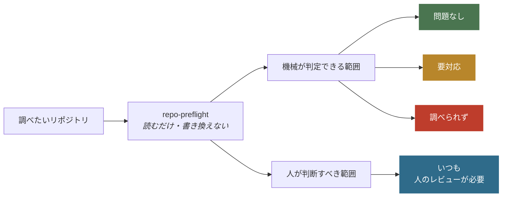
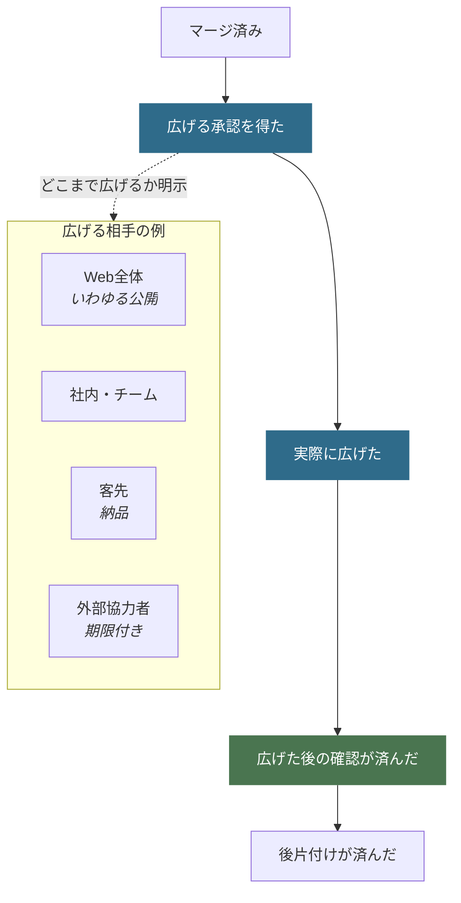

# Repo Preflight

**リポジトリを人に見せる直前に、見せてはいけないものが混ざっていないかを機械で調べる道具です。**

APIキーらしき文字列や自分のPCのパスを、今あるファイルだけでなく**削除済みを含むGitの全履歴から**探します。必須の文書がそろっているか、文書とコードの食い違いがないかも確認します。結果は決まった形式で返るので、人だけでなくAIエージェントやCIからも同じ基準で使えます。

> [!IMPORTANT]
> このツールが「合格」と言っても、それは**機械で調べられた範囲に問題がなかった**という意味だけです。公開してよい、pushしてよい、という承認ではありません。外へ影響する操作は必ず人が決めてください。

## 使い方 — まず動かす

**利用（検査だけ）**に必要なのは Python 3.11 以降と Git だけです。追加のパッケージはありません。

```bash
git clone https://github.com/nexus-ai-2045/repo-preflight.git
cd repo-preflight
python scripts/readiness_scan.py --repo /path/to/your-repo
```

調べたいリポジトリは、このツールとは別の場所にあってかまいません。中身は読むだけで、書き換えません。

**開発・テスト・CI**では別途 `pip install -e ".[test]"`（pytest / black）が必要です。手順は [CONTRIBUTING.md](CONTRIBUTING.md) を参照してください。

### 結果の読み方（応答モード）

同じ CLI でも、返す JSON の schema と `status` 語彙が分かれます。混ぜて読まないでください。

| モード | いつ | schema | `status` |
|---|---|---|---|
| 検査（scan） | `--repo` のみ、または CI | `repo-preflight.scan/v3` | `pass` / `blocked` / `tool_error` |
| 対話（dialogue） | `--intent` 指定時 | `repo-preflight.dialogue/v3` | `needs_human_input` / `blocked` / `ready_after_confirmation` |
| 抑止記録 | `--record-dismissal` | `repo-preflight.preferences/v1` | `recorded` |

**検査モード**の意味:

| 返る値 | 意味 | 次にすること |
|---|---|---|
| `pass`（問題なし） | 機械で調べられる範囲では引っかからなかった | 中身と操作の相手を人が見て決める |
| `blocked`（要対応） | 直すべき点がある | 指摘に対応してもう一度実行する |
| `tool_error`（調べられず） | Gitやファイルを十分に読めなかった | 原因を直すまで、この結果を判断に使わない |

**対話モード**の意味（エージェント向け。詳細は [SKILL.md](SKILL.md)）:

| 返る値 | 意味 | 次にすること |
|---|---|---|
| `needs_human_input` | 質問や設定確認が残っている | 人に聞いてから外への操作をしない |
| `blocked` | secret 等で fail-closed | 無視して進まず、修復方針を聞く |
| `ready_after_confirmation` | 機械不足は埋まっている | 最終確認のあと intent 準備へ |

読めなかったものを「問題なし」とは言いません。**判断がつかないときは、通さない側に倒します。**

## 目的 — 機械が言えることと、人が決めることを分ける

テストが通ったことと、公開してよいことは別です。この分離がこのツールの中心にあります。



右下は自動では変わりません。**「問題なし」だけを根拠に公開しないでください。**

## できること — 自動で調べる範囲

- **認証情報らしき文字列**（APIキー、トークン、秘密鍵の形）と**自分のPCのパス**。消したつもりでも履歴に残っていれば見つけます
- **必須の文書**がそろっているか（README.md、LICENSE、SECURITY.md、CONTRIBUTING.md、PREFLIGHT.md）
- **コミットの名義**（作者・コミッターが意図した名前か）
- **文書とコードの食い違い**（リンク切れ、READMEに書いたコマンドと実体のずれ、コードを変えたのに文書やテストが追随していない、生成物が古い）
- **READMEが読める形か**（必須の節、長さ、そして日本語で書かれている場合は、表が横に伸びすぎていないか・図のラベルが本文と同じ言語か）。表の幅と図のラベルは初期は警告に留め、運用で誤検知がないことを確認してからエラーへ上げます
- GitHubの設定ガイドや運用記録の不足

読むだけで、リポジトリの中身は一切書き換えません。

## 制約 — 調べない範囲

ここは**人が確かめるか、別の道具に任せる**部分です。

- 公開、push、PR、マージ、公開範囲の変更**そのものの実行**（このツールは操作しません）
- 公開してよい権利があるか、個人情報かどうかの**最終判断**
- 使っているライブラリに既知の脆弱性がないか
- GitHub側の今の状態（ブランチ保護、権限、CIが実際に成功したか）
- 「秘密情報が絶対に存在しない」という完全な保証

内蔵の検出は、よくある形式に当てはめて探す補助機能です。**専門の検査ツールと人のレビューを必ず併用してください。**

判定の根拠は結果にも含まれます。項目ごとの理由は [保証すること / 保証しないこと](docs/guarantees-and-limits.md) にまとめています。

## どんなときに使うか

公開専用ではありません。**見せる相手が増える直前**に使います。

| 場面 | 主に確認すること |
|---|---|
| リポジトリを新しく作る | 公開範囲、最初の文書、名義 |
| pushする | 今回の変更、履歴、未コミットの取りこぼし |
| PRを作る | 比較元との差分、文書とテストの追随 |
| マージする | 統合前の残作業と人の確認 |
| GitHub Settingsを整える | remote設定の実測、profile差分、外部影響、rollback |
| チーム共有・納品・公開 | 見せる相手、全履歴、権利と個人情報 |
| リリース準備 | READMEの情報設計と運用記録 |

## AIエージェントから使う

エージェントが次の操作へ進む**直前**に自動で走らせる使い方です。人が毎回「チェックして」と言う必要はありません。stdout は対話 schema（上記）です。

```bash
python scripts/readiness_scan.py --repo PATH --intent <場面> --human
```

`--intent` に入れる語と、追加で要る引数はこれだけです。

| これからすること | `--intent` | 追加で要る引数 |
|---|---|---|
| リポジトリを新しく作る | `create_repo` | （`--repo` も不要） |
| push / PR作成 / マージ | `push` `open_pr` `merge` | `--base-ref origin/比較元` |
| GitHub Settingsの変更準備 | `configure_settings` | `--github-settings-profile solo_public` など |
| 共有・納品・公開 | `publish` | `--audience public` など相手を指定 |
| リリース準備 | `release` | （なし） |

返ってくるのは**質問リスト**です。エージェントはそれを人へ番号付きで見せ、答えが返るまで外部への操作をしません。

`configure_settings` は `gh api` のGETだけで remoteを実測し、`solo_public` / `team_public` / `high_risk_public` と比較します。設定候補は一件ずつ、現在値・推奨値・外部影響・rollback・API操作previewを返します。**設定変更は実行しません。** 403 / 404 / plan制約は `false` とみなさず `unavailable` にします。

```bash
python scripts/readiness_scan.py --repo PATH --intent configure_settings \
  --github-settings-profile solo_public --human
```

**認証情報や個人のパスが見つかったときは、「無視して進む」という選択肢を出しません。**

検査する範囲の絞り込み、同じ質問を次回から出さない設定、GitHub設定ガイドの鮮度確認は [intent 対話の運用オプション](docs/intent-dialogue-options.md) にまとめています。

## 変更ごとに文書とコードのずれを見る

`.repo-preflight-consistency.json` という設定ファイルを置くと、上の検査に加えて、リンク切れ・READMEに書いたコマンドと実体のずれ・コードを変えたのに文書やテストが追随していない箇所・生成物の古さを調べます。**何を守るかは各リポジトリが宣言し、調べる仕組みはこのツールが持ちます。**

いきなり全部を止めると運用が回らないので、3段階で導入します。

| 段階 | ふるまい |
|---|---|
| `shadow` | 調べるが止めない。まず実態を知る |
| `ratchet` | 今ある分は通し、**新しく増えた分だけ**止める |
| `enforce` | 引っかかったら止める |

`ratchet` は「締める方向にしか進めない」やり方です。問題が減ったときは、見逃す枠も一緒に縮めるよう求めます。

このリポジトリ自身は `enforce` に固定し、CIで毎回検査しています（ubuntu / macOS は Python 3.11 と 3.13、Windows は 3.13 のみ）。設定を消したり段階を下げたりすると、CIが失敗します。設定例と境界は [リポジトリ整合性ゲート](docs/repository-consistency-gate.md)、長く維持する設計判断は [ADR一覧](docs/adr/README.md)、実行環境の保証境界は [docs/runtime-support.md](docs/runtime-support.md) を参照してください。

加えて、trackedなのにignore対象でもあるpathの新規増加は、公開wheel `ai-ratchet-gate==0.1.1` とreview済みbaselineを使って全CI jobで止めます。baselineの作成・拡大・縮小は人間レビュー対象です。

## そのまま調べる（CIや現状把握）

`--repo` だけを渡すと、質問をせずに検査結果だけを返します（scan schema）。CIから使うときはこの形です。

変更差分を見る設定（`impact_map` や生成物）がある場合、比較元の指定が要ります。指定がなければ「範囲を確定できない」として止まります。ここでも、わからないまま通すことはしません。

差分へ絞るときは **`--base-ref`**（内部の `scan_scope.mode` は `target_diff`）を使います。CLI に `--target-diff` フラグはありません。

### 主な引数

| 引数 | 何をするか |
|---|---|
| `--intent <場面>` | 操作の直前ゲート（対話 schema）として動かす |
| `--repo <パス>` | 調べる対象。新規作成のときだけ不要 |
| `--base-ref <比較元>` | 検査の範囲を今回の変更へ絞る（`push` / `open_pr` / `merge`） |
| `--consistency-base-ref <比較元>` | 全体は調べたまま、文書チェックだけ差分に絞る |
| `--expected-identity "<名前> <メール>"` | 全コミットが指定の名義かを確認する |
| `--audience <相手>` | 見せる相手を指定する |
| `--github-settings-profile <profile>` | Settings比較profile（`solo_public` / `team_public` / `high_risk_public`） |
| `--human` | 質問と要約を人向けに、結果は機械向けに分けて出す |
| `--release` | READMEの情報設計チェックも一緒に走らせる |
| `--interactive` | コンソール補助（TTYで検査オプションを選ぶ。本体ではない） |
| `--record-dismissal <id>` | 推奨質問の抑止を `.repo-preflight.json` に記録して終了 |
| `--dismissal-mode` | `7d` / `30d` / `90d` / `forever`（`--record-dismissal` と併用） |
| `--dismissal-reason` | 抑止理由（任意） |

対話 UI が出す「次から出さない」は主に `30d` / `90d` / `forever` です。CLI の `--dismissal-mode` はそれに加え `7d` も受け付けます。

### 終了コード

| 値 | 意味 |
|---|---|
| `0` | 検査 `pass`、対話 `ready_after_confirmation`、または抑止記録 `recorded` |
| `1` | 検査 `blocked`、または対話の `needs_human_input` / `blocked` |
| `2` | 検査そのものが失敗した（`tool_error`） |

このツールは既定で読むだけです。リポジトリ作成、push、PR、マージ、公開範囲の変更、投稿は行いません。

## 見せる相手を広げるとき

公開だけが終点ではありません。社内共有、客先納品、外部協力者への一時的な提供でも、**承認 → 実際に広げる → 広げた後の確認**という順序は同じです。



相手ごとに必要な証拠が変わります。公開なら「外から見えるファイルと全コミット履歴」、チーム共有なら「権限を持つ人の一覧」、外部協力者なら「与えた権限と、いつ切れるか」です。非公開のまま止めることも、PRまで、マージまでも、正式な完了地点として扱います。詳しくは [状態一覧](references/lifecycle.md)。

## Skill として使う（Claude Code / Grok / Codex）

| 使う環境 | 入口 |
|---|---|
| 正本 | [SKILL.md](SKILL.md) |
| Claude Code | [runtime/claude-code/SKILL.md](runtime/claude-code/SKILL.md) |
| Grok | [runtime/grok/SKILL.md](runtime/grok/SKILL.md) |
| Codex | [runtime/agents/openai.yaml](runtime/agents/openai.yaml) |

このマシンで最小限動くかを確認するには、次を実行します。

```bash
python scripts/runtime_smoke.py --repo .
```

各環境への配り方と、何が機械で検証され何が運用の約束なのかは [docs/runtime-support.md](docs/runtime-support.md) にまとめています。skillは**各自がcloneしてから配布**してください。他人のskillフォルダをコピーしないでください。

公開リポジトリの保護設定やマージ方式の選び方は [GitHub repository設定ガイド](references/github-settings.md) を参照してください。参加の約束は [CODE_OF_CONDUCT.md](CODE_OF_CONDUCT.md)、脆弱性報告は [SECURITY.md](SECURITY.md) です。

## v0.1.x から移ってきた方へ

v0.2.0 でリポジトリ名（`public-readiness` → `repo-preflight`）と、必須のレビュー記録ファイル（`PUBLIC_READY.md` → `PREFLIGHT.md`）が変わりました。手順は [v0.1.x から v0.2.0 への移行](docs/migration-v0.1-to-v0.2.md) を読んでください。

## License

MIT License。詳細は [LICENSE](LICENSE) を参照してください。
