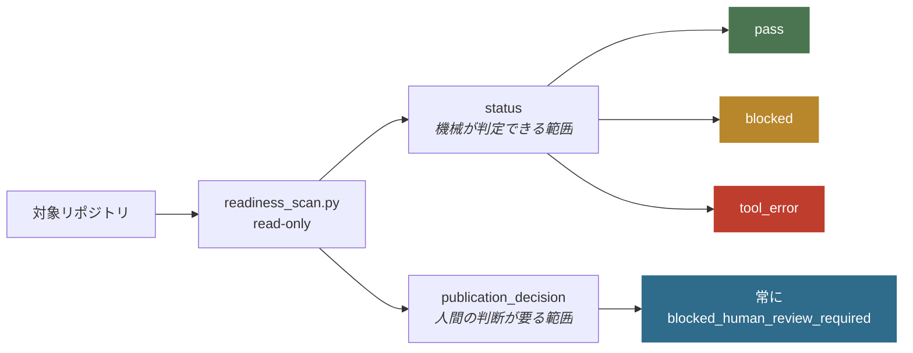
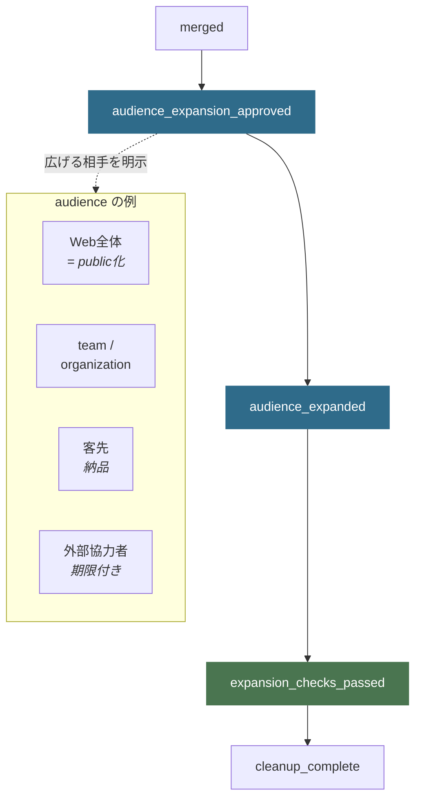

# Repo Preflight

リポジトリを人に見せる前に、見せてまずいものが混ざっていないか機械で調べる道具です。

APIキーらしき文字列と自分のPCのパスは、今のファイルだけでなく**過去の全履歴まで遡って**探します。消したつもりでも履歴に残っていれば見つけます。必要な文書が揃っているかは現在のファイルを見ます。
ただし「公開してよい」とは絶対に言いません。調べられた範囲を報告するだけで、公開の判断は人間が下します。

public化専用ではありません。privateリポジトリをチームへ開くとき、成果物を客先へ納品するとき、外部の協力者へ渡すときも、必要な検査は同じです。

AIエージェントから使う場合は、リポジトリ作成・push・PR・公開の**直前に自動で発火**し、
「この設定にしますか？」を人間に聞いてから進みます。詳しくは [AI 実装フロー](#ai-実装フロー--intent-対話-本体)。

> **v0.1.x から来た方へ** — v0.2.0 でリポジトリ名と必須ファイル名が変わりました。
> `public-readiness` → `repo-preflight`、`PUBLIC_READY.md` → `PREFLIGHT.md` です。
> 移行手順は [v0.1.x からの移行](#v01x-からの移行) を読んでください。

## 目的 — 答えること、答えないこと

テストが通ったことと、公開してよいことは別です。この分離が設計の中心にあります。



`status: pass` は「このCLIが担当するローカル自動検査に合格した」という意味だけを持ちます。
`publication_decision` は常に人間レビューを要求し、自動で `approved` にはなりません。
**`pass` だけを根拠に公開しないでください。**

## 保証すること / 保証しないこと

対話モードでも非対話モードでも、次の境界は同じです。JSON report にも `guarantees` / `non_guarantees` として入ります。

### できること — 保証する範囲

| 対象 | 内容 |
|---|---|
| 読み取り専用検査 | ローカルGitの現在treeと履歴を変更せず読む |
| 自動判定項目 | 必須文書・secret候補・個人path・作者名義・CI設定の最低限の構造 |
| status の意味 | pass / blocked / tool_error はCLI担当分の結果だけ |
| 公開判定の分離 | `publication_decision` は常に人間レビュー要求。自動承認しない |
| 秘密値の非出力 | 検出結果に秘密値そのものを載せない |

削除済みのファイルも履歴に残っていれば検出します。

### 制約 — 保証しない範囲 (別証拠・人間判断が要る)

| 対象 | なぜCLIで判定しないか |
|---|---|
| 秘密情報が「存在しない」ことの完全保証 | 独自形式・符号化・大容量blob・バイナリ内は見逃し得る |
| 依存ライブラリの既知脆弱性 | エコシステム固有の最新監査が要る |
| 第三者素材を公開する権利 | 法的判断 |
| branch保護・review必須設定 | GitHub側の現在状態 |
| CIが実際に成功したか | remoteの実行結果 |
| 障害の通知先、復旧手順 | 実際に試した記録が要る |
| README・個人情報・公開範囲の目視 | 人間の確認 |
| 公開・push・merge・visibility変更 | 実行機能を持たない |

内蔵の正規表現は代表的な秘密情報の形式を検出する補助機能です。
専門のsecret scanner、依存関係の監査、人間レビューを必ず併用してください。

## クイックスタート

PyPIには公開していません。このリポジトリを取得して使います。
追加の依存はなく、Python 3.11以降とgitがあれば動きます。

```bash
git clone https://github.com/nexus-ai-2045/repo-preflight.git
cd repo-preflight
```

### AI 実装フロー — intent 対話 (本体)

エージェントが次の操作に進む**直前**に自動発火します。ユーザーが毎回「preflightして」と言う必要はありません。

| これからやること | コマンド |
|---|---|
| リポジトリ新規作成 | `python scripts/readiness_scan.py --intent create_repo --human` |
| push | `python scripts/readiness_scan.py --repo PATH --intent push --human` |
| PR 作成 | `python scripts/readiness_scan.py --repo PATH --intent open_pr --human` |
| merge | `python scripts/readiness_scan.py --repo PATH --intent merge --human` |
| 公開 / 共有 / 納品 | `python scripts/readiness_scan.py --repo PATH --intent publish --audience public --human` |
| release 準備 | `python scripts/readiness_scan.py --repo PATH --intent release --human` |

返ってくるのは「質問パケット」です。エージェントはこれを人間へ番号付きで転記し、回答があるまで外部操作しません。

```json
{
  "schema": "repo-preflight.dialogue/v3",
  "intent": "open_pr",
  "status": "needs_human_input",
  "publication_decision": "blocked_human_review_required",
  "guarantees": ["..."],
  "non_guarantees": ["..."],
  "proposals": [
    {
      "id": "create_missing_security_md",
      "question": "SECURITY.md がありません。Pull Request 作成 の前にテンプレートから作成しますか?",
      "options": [
        {"id": "yes", "label": "SECURITY.md を作成する"},
        {"id": "no", "label": "作成せず停止する"}
      ],
      "default": "yes",
      "blocks_intent": true
    }
  ],
  "confirmations": [
    {
      "id": "confirm_open_pr",
      "question": "次の操作へ進んでよいですか: Pull Request 作成 ...",
      "default": "cancel"
    }
  ],
  "agent_instructions": ["..."]
}
```

質問の例:

- 「新しい GitHub リポジトリは private で作成しますか？」
- 「SECURITY.md がありません。テンプレートから作成しますか？」
- 「作者名義の固定照合が未設定です。設定しますか？」
- 「未コミットの変更があります。コミットしてから進めますか？」

secret や個人 path の検出時は **「無視して進む」選択肢を出しません**。

#### 次から出さない (dismiss / snooze)

完璧な設定でなくても運用できるよう、**推奨・任意の再質問**には次の選択肢が付きます。

- `dismiss_30d` — 30日間この項目を出さない
- `dismiss_90d` — 90日間この項目を出さない
- `dismiss_forever` — 次からこの項目は出さない

記録先は採用先リポジトリの `.repo-preflight.json` です。

```bash
python scripts/readiness_scan.py --repo /path/to/your-repo \
  --record-dismissal configure_expected_identity \
  --dismissal-mode forever \
  --dismissal-reason "private only for now"
```

抑止**できない**もの: secret / 個人 path / 必須文書欠落 / dirty worktree / 危険操作の最終確認 など。

#### GitHub 更新の反映保証

| 保証すること | 保証しないこと |
|---|---|
| 同梱 `references/github-settings.md` の `last_reviewed` 期限切れを検知し、「ガイドを更新しますか？」を出す | GitHub 製品変更をリアルタイムで自動追従することそのもの |
| 更新手順と公式 docs 入口を文書に持つ | 「常に最新の GitHub 公式と完全一致」という永久保証 |

期限切れ時は intent 対話に `refresh_github_settings_baseline` が出ます。更新後は marker の日付を進めます。

### 素の検査 (CI / 現状把握)

`--repo` だけなら従来どおり検査JSONです。

```bash
python scripts/readiness_scan.py --repo /path/to/your-repo
```

```json
{
  "schema": "repo-preflight.scan/v3",
  "status": "pass",
  "publication_decision": "blocked_human_review_required",
  "repo": "your-repo",
  "guarantees": ["..."],
  "non_guarantees": ["..."],
  "checks": {
    "secret_scan": { "status": "pass", "finding_count": 0 },
    "required_documents": { "status": "pass", "missing": [], "invalid": [] }
  }
}
```

### オプション

| オプション | 用途 |
|---|---|
| `--intent <name>` | AI操作直前ゲート。create_repo / push / open_pr / merge / publish / release |
| `--repo <path>` | 検査対象。create_repo 以外では必須 |
| `--release` | README情報設計ゲートも同時に実行する |
| `--expected-identity "<Name> <mail>"` | 全commitの作者/committerが指定の名義かを検査する |
| `--audience <key>` | 見せる相手 (public/team/client/collaborator/local) |
| `--human` | 質問文/要約をstderr、JSONをstdoutへ |
| `--interactive` / `-i` | コンソール補助 (本体ではない) |

公開名義を統一しているリポジトリでは、履歴に個人名義が混ざっていないかを確認できます。

```bash
python scripts/readiness_scan.py --repo /path/to/your-repo \
  --expected-identity "Example <dev@example.invalid>"
```

### 終了コード

| コード | 意味 |
|---|---|
| `0` | 検査 pass、または intent 対話が `ready_after_confirmation` |
| `1` | 検査 blocked、または intent が `needs_human_input` / `blocked`（人間の回答待ち） |
| `2` | Gitや履歴取得など検査自体が失敗 |

CLIは既定で読み取り専用です。リポジトリ作成、push、PR、merge、visibility変更、投稿は行いません。
`--release` もREADMEやreleaseを自動で変更・作成しません。

## 見せる相手を広げる流れ

public化は終点のひとつであって、唯一の終点ではありません。
どの相手に広げる場合も、承認 → 実測 → 再確認の3段を通ります。



`audience` ごとに必要な証拠が変わります。public化なら「Webから見えるファイルと全commit履歴」、
team共有なら「collaborator権限とaccess一覧」、外部協力者なら「付与した権限と失効条件」です。
private保存、PRまで、mergeまでも正規の完了地点として扱います。詳細は [状態一覧](references/lifecycle.md)。

## v0.1.x からの移行

v0.2.0 でリポジトリ名 (`public-readiness` → `repo-preflight`) と、必須のレビュー記録
(`PUBLIC_READY.md` → `PREFLIGHT.md`) が変わりました。
手順は [v0.1.x から v0.2.0 への移行](docs/migration-v0.1-to-v0.2.md) を読んでください。

## Skill (Claude Code / Grok / Codex)

| Runtime | 入口 |
|---|---|
| 正本 | [SKILL.md](SKILL.md) |
| Claude Code | [runtime/claude-code/SKILL.md](runtime/claude-code/SKILL.md) |
| Grok | [runtime/grok/SKILL.md](runtime/grok/SKILL.md) |
| Codex | [runtime/agents/openai.yaml](runtime/agents/openai.yaml) |

保証範囲（何が機械検証され、何が運用契約か）は
[docs/runtime-support.md](docs/runtime-support.md)。

```bash
# このマシンで CLI + skill 入口の最小保証を確認
python scripts/runtime_smoke.py --repo .

# Claude Code / Grok の skills へ portable 配布 (確認のみ → 書込)
python scripts/install_runtime_skills.py --repo .
python scripts/install_runtime_skills.py --repo . --apply

# install 後は skill 側 launcher を使う (絶対 path 不要)
python ~/.claude/skills/repo-preflight/run_preflight.py --intent create_repo --human
```

skill は **各自が clone したうえで `--apply`** する。他人の skill フォルダをコピーしない。

公開リポジトリのruleset、merge方式、Actions権限、security機能の選択理由は
[GitHub repository設定ガイド](references/github-settings.md) を参照してください。

## License

MIT License。詳細は [LICENSE](LICENSE) を参照してください。
